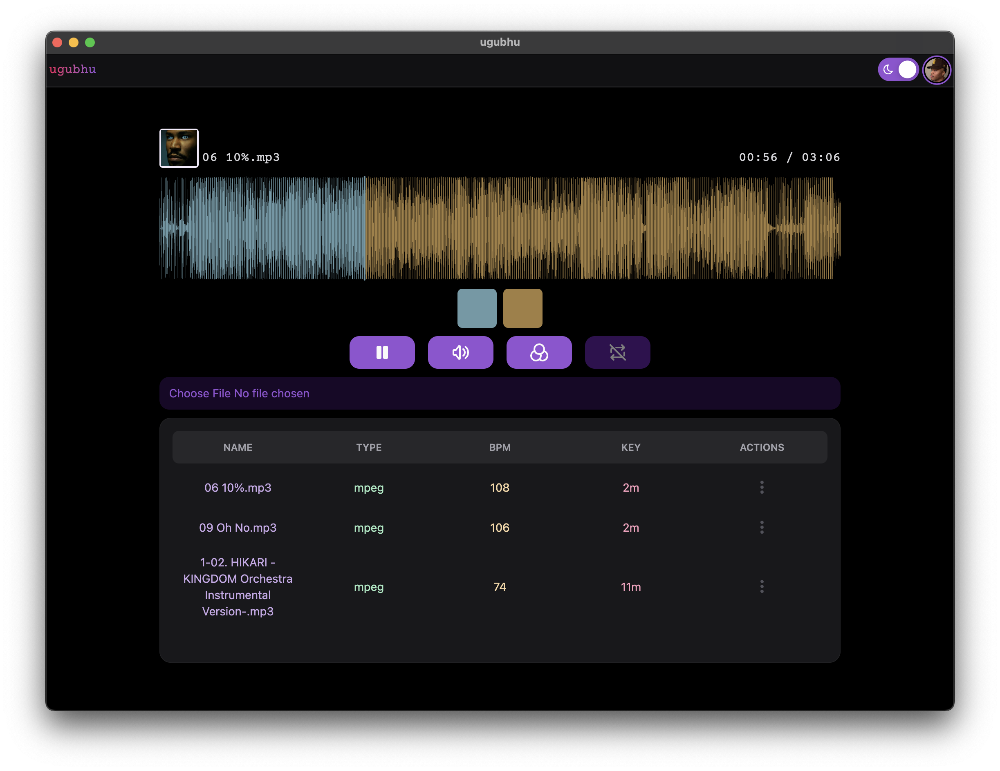

# Ugubhu

Ugubhu is a desktop music player built with **Electron**, **React**, and **Howler.js**, inspired by my love for music and the nostalgia of the legendary Winamp player.

As a music lover who grew up with Winamp’s iconic visuals, dedicated music storage, and rich organization tools, I wanted to bring that feeling back — but with a modern tech stack and a cleaner, more customizable experience.

---

## 

## ✨ Current Features

- **Local Audio Playback** — Load and play music files directly from your computer.
- **Waveform Visualization** — Real-time audio waveform rendering powered by [WaveSurfer.js](https://wavesurfer-js.org/).
- **Metadata Parsing** — Automatically extracts track information using [music-metadata](https://github.com/Borewit/music-metadata).
- **Playback Controls** — Play, pause, stop, mute/unmute, loop, and scrub through tracks.
- **Customizable Colors** — Change waveform and UI highlight colors to fit your vibe.
- **Track Progress Display** — Shows current time and duration while playing.

---

## 🛠 Actively In Development

I’m currently working on:

- **Local File Storage** — Save and manage a personal library directly in Ugubhu for persistent use across sessions.
- **Playlisting** — Create and organize playlists for albums, genres, or custom mixes.
- **UI Improvements** — A cleaner, more intuitive interface with better responsiveness and animations.
- **Bulk Import** — Drag-and-drop entire folders of music for quick library building.

---

## 🚀 Tech Stack

- **Electron** — Desktop application framework.
- **React.js** — Front-end UI.
- **TypeScript** — Type safety and maintainability.
- **Howler.js** — Audio playback.
- **WaveSurfer.js** — Waveform visualization.
- **music-metadata** — Audio file metadata extraction.
- **Tailwind CSS** — Styling.

---

## 📌 Roadmap

- ✅ Core playback and visualization
- ⏳ Library persistence (local storage)
- ⏳ Playlist management
- ⏳ Improved UI & animations
- ⏳ Folder-based bulk import

---

## 🤝 Contributing

This is an active personal project, but I welcome feedback, feature suggestions, and collaboration ideas. Feel free to open an issue or submit a pull request.

---
